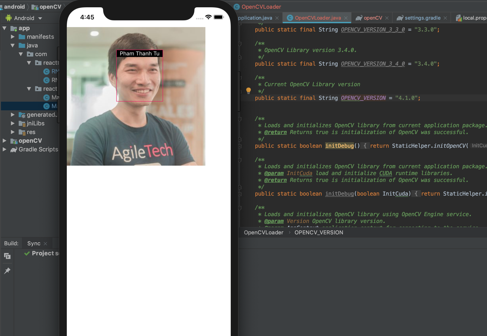

# What this tutorial is about

This tutorial is how to use React Native together with OpenCV for image processing. This example uses native Java and Objective-C bindings for OpenCV. In this example we use the device's camera to take a photo and detect whether the taken photo is clear or blurred.

# Demo

The examples below show the situation right after taking a photo. The first one shows what happens if we take a blurry photo and the second one is the situation after we took a clear photo and are able to proceed with it to do whatever we want.

# Prerequisites

1. XCode
2. Android Studio

# How to run the project

1. Clone the repository.
2. `cd react-native-opencv-tutorial`
3. `npm i` or `yarn`
4. Run `./downloadAndInsertOpenCV.sh 4.1.0`.
5. Import OpenCV to Android Studio, From File -> New -> Import Module, choose sdk/java folder in the unzipped opencv archive.
6. Update build.gradle under imported OpenCV module to update 4 fields to match your project's `build.gradle` 

   a) compileSdkVersion 
   b) buildToolsVersion 
   c) minSdkVersion 
   d) targetSdkVersion.

7. Add module dependency by Application -> Module Settings, and select the Dependencies tab. Click + icon at bottom, choose Module Dependency and select the imported OpenCV module. For Android Studio v1.2.2, to access to Module Settings : in the project view, right-click the dependent module -> Open Module Settings.
8. `react-native run-ios` or `react-native run-android`.

## Additional notes

In case of any `downloadAndInsertOpenCV.sh` script related errors, please, check the paths inside this file and change them if they do not match yours.
If this script does not run at all since it has no permissions, run `chmod 777 downloadAndInsertOpenCV.sh`.

If you do not have `React Native` installed, type `npm i -g react-native-cli` in the terminal.
